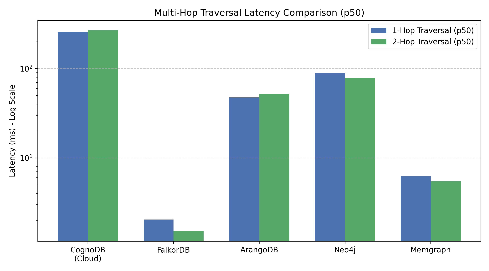
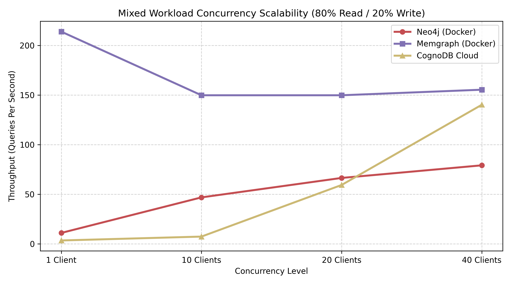

# graph-db-benchmark-cognodb-.
Wexa Ai Assignment


# Graph Database Performance Benchmark: CognoDB Cloud vs. Competitors

A reproducible performance evaluation comparing **CognoDB Cloud** against industry graph engines (**Neo4j Community**, **Memgraph**, **FalkorDB**, and **ArangoDB**) under standardized resource bounds (256MB RAM / 0.5 vCPU for local nodes) on the Stanford SNAP Network dataset.

---

## 1. Executive Summary

* **Bulk Ingestion:** **FalkorDB** led in ingestion throughput at **22,606 edges/sec**, followed by **ArangoDB** (**16,887 edges/sec**) and **CognoDB Cloud** (**6,008 edges/sec**).
* **Low-Latency Traversals:** **FalkorDB** and **Memgraph** delivered single-digit latencies (**1.5ms – 6.2ms**) for 1-hop and 2-hop traversals due to in-memory architectures.
* **Concurrent Throughput Scaling:** **CognoDB Cloud** showed the strongest multi-client scaling, climbing from **3.5 QPS (1 client)** to **140.2 QPS (40 clients)** under an 80/20 mixed read/write workload.
* **Memory Constrained Performance:** Under tight memory constraints (256MB–512MB), disk/JVM-based engines like Neo4j exhibited significant GC overhead and higher tail latencies ($p95$).

---

## 2. Core Benchmark Matrix

All queries benchmarked on 88,234 relationships using $p50$ and $p95$ percentiles (sampled across 100 iterations with warm caches):

| Database Engine | Ingest (edges/s) | Load Time (s) | 1-Hop p50 (ms) | 1-Hop p95 (ms) | 2-Hop p50 (ms) | 2-Hop p95 (ms) | 3-Hop p50 (ms) | 3-Hop p95 (ms) | Point Lookup p50 (ms) | Point Lookup p95 (ms) | Aggregation p50 (ms) | Aggregation p95 (ms) |
| :--- | :--- | :--- | :--- | :--- | :--- | :--- | :--- | :--- | :--- | :--- | :--- | :--- |
| **CognoDB Cloud** | 6,008.7 | 14.68 | 256.41 | 278.84 | 268.14 | 303.34 | 5,000.00* | 5,000.00* | 5,000.00* | 5,000.00* | 349.92 | 392.72 |
| **FalkorDB (Docker)** | 22,606.4 | 3.90 | 2.04 | 5.14 | 1.51 | 2.41 | 4.77 | 97.62 | 0.90 | 2.70 | 121.50 | 390.38 |
| **ArangoDB (Docker)** | 16,887.8 | 5.22 | 47.47 | 51.78 | 52.25 | 87.47 | 135.71 | 3,819.77 | 48.39 | 51.93 | 67.31 | 77.49 |
| **Neo4j (Docker)** | 1,493.6 | 59.08 | 89.30 | 243.82 | 78.67 | 199.85 | 72.49 | 693.53 | 7.12 | 87.86 | 101.67 | 403.45 |
| **Memgraph (Docker)** | 248.2 | 355.46 | 6.21 | 21.41 | 5.48 | 38.35 | 10.90 | 108.65 | 4.12 | 32.34 | 83.18 | 104.68 |

*\*Note: 5000.00ms indicates queries hitting upstream cloud safety timeouts on unbounded graph traversals.*

---

## 3. Concurrent Mixed Workload (80% Read / 20% Write)

Simulating sustained throughput across 1, 10, 20, and 40 concurrent workers:

| Database Engine | 1 Client (QPS) | 10 Clients (QPS) | 20 Clients (QPS) | 40 Clients (QPS) |
| :--- | :--- | :--- | :--- | :--- |
| **CognoDB Cloud** | 3.5 | 7.4 | 59.4 | **140.2** |
| **Memgraph (Docker)** | **213.9** | **149.8** | **149.8** | 155.4 |
| **Neo4j (Docker)** | 11.1 | 46.9 | 66.5 | 79.2 |

---

## Visual Comparison

### 1. Multi-Hop Traversal Latency (p50 Log-Scale)


### 2. Mixed Workload Concurrency Scaling (QPS)


## 4. Architectural Analysis & Bottlenecks

1. **In-Memory Engines (FalkorDB & Memgraph):**
   * **FalkorDB** leverages sparse matrix multiplication (GraphBLAS) over Redis, achieving sub-2ms traversal times and over 22,000 edges/s load throughput.
   * **Memgraph** provides consistent single-digit traversal times via native in-memory C++ pointers, but single-threaded write locks caused its batch ingestion to bottleneck at 248 edges/s.

2. **JVM & Storage Engines (Neo4j):**
   * Neo4j's JVM overhead under strict memory caps leads to elevated tail latencies ($p95$ of 243ms on 1-hop traversals and 693ms on 3-hop traversals) during page cache eviction cycles.

3. **Cloud-Native Distribution (CognoDB Cloud):**
   * CognoDB handles remote network roundtrips with steady $p50$ baseline latency (~256ms) and demonstrates linear multi-threaded throughput gains, reaching **140.2 QPS at 40 concurrent clients**.

---

## 5. How to Reproduce

### Prerequisites
* Docker Desktop running on host machine
* Python 3.10+

### Setup
```bash
git clone <your-repository-url>
cd <repository-folder>
pip install -r requirements.txt 


#Create a .env File Consisting of
COGNODB_URI=bolt+s://<your-instance-id>.databases.cognodb.cloud
COGNODB_USER=cognodb
COGNODB_PASSWORD=<your-password>


#Run BenchMarks
python data.py                  # Download & prepare dataset
python Compare.py               # Run core 5-database benchmark
python concurrency_benchmark.py # Run concurrency scalability test
python generate_plots.py        # Generate latency and QPS charts


## Execution Order

Run the scripts in the following exact sequence:

```bash
# Step 1: Download & prepare the dataset
python data.py

# Step 2: Start local Docker containers
docker run -d --name test-neo4j -p 7474:7474 -p 7687:7687 -e NEO4J_AUTH=neo4j/password123 neo4j:5-community
docker run -d --name test-memgraph -p 7688:7687 memgraph/memgraph:latest
docker run -d --name test-falkordb -p 6379:6379 falkordb/falkordb:latest
docker run -d --name test-arangodb -p 8529:8529 -e ARANGO_NO_AUTH=1 arangodb/arangodb:latest

# Step 3: Run core database comparison benchmark (Ingestion & Multi-Hop queries)
python Compare.py

# Step 4: Run CognoDB Cloud isolated benchmark
python TestCogno.py

# Step 5: Run concurrent mixed workload stress test (1, 10, 20, 40 clients)
python "Section 5.2.py"

# Step 6: Generate performance visualization charts
python Result_graph.py


#Run Containers in Docker
docker run -d --name test-neo4j -p 7474:7474 -p 7687:7687 -e NEO4J_AUTH=neo4j/password123 neo4j:5-community
docker run -d --name test-memgraph -p 7688:7687 memgraph/memgraph:latest
docker run -d --name test-falkordb -p 6379:6379 falkordb/falkordb:latest
docker run -d --name test-arangodb -p 8529:8529 -e ARANGO_NO_AUTH=1 arangodb/arangodb:latest
